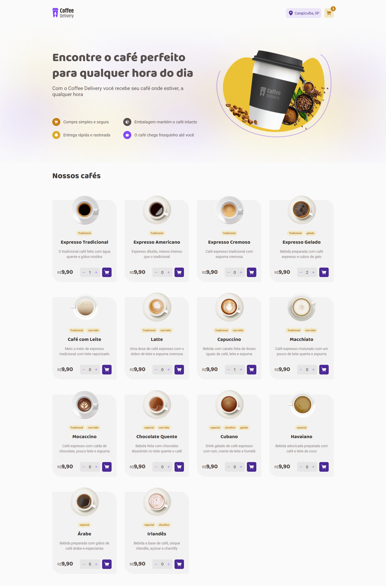
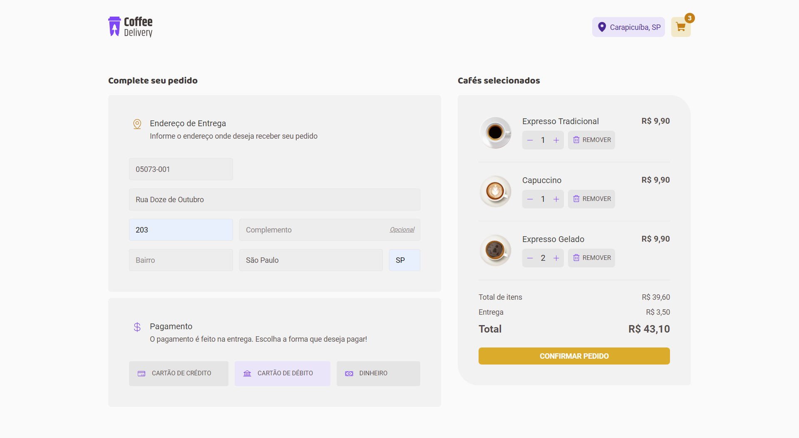

# Coffee Delivery

Esse aplicativo foi desenvolvido no curso <a href="https://app.rocketseat.com.br/journey/react-js-2022/overview" target="_blank">ReactJS</a> , é aplicação para gerenciar um carrinho de compras que era um dos desafio do curso.

|Home|Checkout|Success|
|-------|------|------|
||||

<a href="https://www.figma.com/proto/5yT9ZzZmRQRS4yivGGB3pl/Coffee-Delivery-%E2%80%A2-Desafio-React?node-id=13024-587&t=DVLtbcOeovG1IQIr-1" target="_blank">Link Figma</a>

## 🔨 Funcionalidades do projeto

Nesse desafio, você vai desenvolver uma aplicação para gerenciar um carrinho de compras de uma cafeteria fictícia, que contém as seguintes funcionalidades:

- Listagem de produtos (cafés) disponíveis para compra
- Adicionar uma quantidade específicas de itens no carrinho
- Aumentar ou remover a quantidade de itens no carrinho
- Formulário para o usuário preencher o seu endereço
- Exibir o total de itens no carrinho no Header
- Exibir o valor total da soma de itens no carrinho multiplicados pelo valor

## ✔️ Técnicas e tecnologias utilizadas

Lista das bibliotecas utilizadas no desenvolvimento:

- `react`
- `react-dom`
- `react-router-dom`
- `vite`
- `TypeScript`
- `phosphor-react`
- `styled-components`
- `react-hook-form`
- `@hookform/resolvers`
- `zod`

## 🛠️ Abrir e rodar o projeto

Dentro da pasta do projeto execute npm i ou yarn para instalar as dependências e npm run dev ou yarn dev para iniciar o projeto.